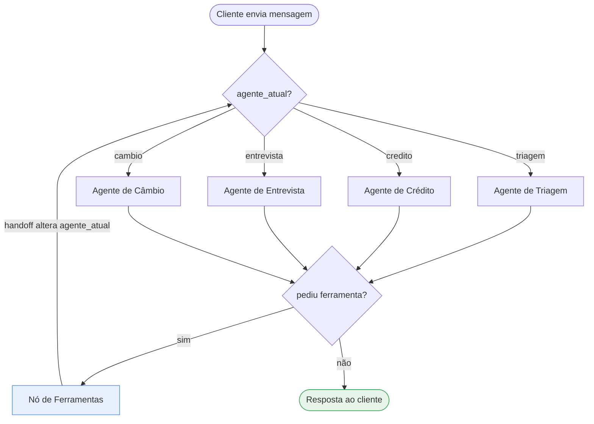

# 🏦 Banco Ágil — Agente Bancário Inteligente

Sistema de atendimento ao cliente de um banco digital fictício, conduzido por
agentes de IA especializados que se revezam **sem que o cliente perceba a
transição**. Construído com **LangGraph + Google Gemini**, com interface de
testes em **Streamlit**.

---

## 📋 Visão Geral

O cliente conversa com um único atendente, o "Ágil". Por trás dele, quatro
agentes especializados dividem o trabalho:

| Agente | Responsabilidade | Ferramentas |
|---|---|---|
| **Triagem** | Recepciona, autentica (CPF + data de nascimento) e direciona | `autenticar_cliente`, direcionamentos |
| **Crédito** | Consulta limite e processa pedidos de aumento | `consultar_limite_credito`, `solicitar_aumento_limite` |
| **Entrevista de Crédito** | Entrevista financeira e recálculo do score | `realizar_entrevista_credito` |
| **Câmbio** | Cotação de moedas em tempo real | `consultar_cotacao_moeda` |

Nenhum agente atua fora do seu escopo: **cada um recebe apenas o seu próprio
conjunto de ferramentas**, então a restrição é garantida pelo código, não
apenas pelo prompt.

---

## 🏗 Arquitetura do Sistema

### Topologia do grafo

Os quatro agentes são **nós irmãos** de um mesmo grafo, e não um supervisor
com subgrafos. O que decide quem responde é o campo `agente_atual` do estado
compartilhado.



**Como a transição fica invisível:** o histórico de mensagens é único e
compartilhado. Quando uma ferramenta de handoff troca `agente_atual`, o
próximo nó já enxerga toda a conversa anterior e simplesmente continua
falando. Não há reapresentação, não há "vou te transferir".

### Estado compartilhado

```python
class EstadoAtendimento(TypedDict):
    messages: Annotated[list, add_messages]  # histórico único
    agente_atual: str                        # quem responde agora
    autenticado: bool                        # porteiro das ferramentas
    cpf: str | None
    nome: str | None
    tentativas_autenticacao: int             # limite de 3 do desafio
    ultimo_status_solicitacao: str | None     # 'aprovado' / 'rejeitado'
    encerrado: bool                          # finaliza o loop
```

Guardar `autenticado` **no estado, e não no prompt**, é o que impede o modelo
de "alucinar" uma autenticação: as ferramentas sensíveis leem esse campo
diretamente e recusam a execução se ele for falso.

### Camadas

```
src/banco_agil/
├── config.py              # caminhos, modelo, pesos do score
├── state.py               # EstadoAtendimento
├── graph.py               # grafo, retentativas e SessaoAtendimento
├── erros.py               # exceções de domínio
├── utils.py               # normalização de CPF, datas, valores
├── agents/prompts.py      # prompt de cada agente
├── tools/                 # ferramentas (uma por responsabilidade)
│   ├── triagem.py  credito.py  entrevista.py  cambio.py
│   ├── handoff.py         # redirecionamentos implícitos
│   └── comuns.py          # encerramento
├── services/              # regra de negócio pura, sem LLM
│   ├── credito.py  score.py  cambio.py
└── repositories/          # acesso a CSV (atômico e com lock)
    ├── clientes.py  score_limite.py  solicitacoes.py  csv_base.py
```

A regra de negócio (`services/`) **não conhece LLM nem LangGraph**. É por isso
que a fórmula de score e a política de crédito são testáveis sem chave de API.

### Como os dados são manipulados

| Arquivo | Uso | Escrita |
|---|---|---|
| `data/clientes.csv` | Autenticação, limite e score | Reescrita atômica ao atualizar score/limite |
| `data/score_limite.csv` | Política: faixa de score → teto de crédito | Somente leitura |
| `data/solicitacoes_aumento_limite.csv` | Pedidos formais de aumento | Append + atualização de status |

**Escrita atômica:** a base de clientes é reescrita inteira quando o score
muda. Gravar direto no arquivo final significaria perder tudo se o processo
morresse no meio, então a gravação vai para um arquivo temporário e usa
`os.replace`, que é atômico no mesmo volume.

**Concorrência em dois níveis.** Um `RLock` por arquivo protege as threads do
mesmo processo (o Streamlit atende cada sessão em uma). Isso não basta: um
lock de processo não atravessa a fronteira do SO, e duas instâncias do app —
ou o app e a CLI — se atropelariam. Por isso há também um **lock de arquivo do
próprio sistema operacional** (`msvcrt` no Windows, `fcntl` no POSIX) sobre um
arquivo sentinela `.lock`. A trava é reentrante, o que permite a
`analisar_aumento` gravar o pedido e concluir o status como uma operação só.

> Medição real: 3 processos gravando 40 pedidos cada. **Sem** o lock de
> arquivo, 2 das 120 linhas somem — silenciosamente, sem exceção nenhuma.
> **Com** o lock, as 120 sobrevivem. O teste que cobre isso está em
> `tests/test_concorrencia.py`.

**Injeção de fórmula em CSV:** uma célula iniciada por `=`, `+`, `-` ou `@`
vira fórmula ao abrir o arquivo no Excel. Como esses CSVs são a saída oficial
do sistema e podem ser abertos por um analista, toda célula gravada passa por
uma sanitização que prefixa esses casos com apóstrofo.

#### Ciclo de vida de uma solicitação de aumento

```
1. registra 'pendente'  →  solicitacoes_aumento_limite.csv
2. lê o teto do score   →  score_limite.csv
3. conclui              →  'aprovado' ou 'rejeitado' (mesma linha)
4. se aprovado          →  efetiva o novo limite em clientes.csv
```

O pedido é gravado **antes** da decisão de propósito: mesmo que a análise
falhe, fica o rastro de que o cliente pediu.

---

## ✅ Funcionalidades Implementadas

### Agente de Triagem
- [x] Saudação inicial automática, antes de o cliente digitar
- [x] Coleta de CPF e data de nascimento, uma pergunta por vez
- [x] Validação contra `clientes.csv`
- [x] Limite de **3 tentativas** — na terceira falha, encerra com cordialidade
- [x] Falha na autenticação não revela qual campo estava errado
- [x] Falha de infraestrutura (CSV ilegível) **não consome** tentativa do cliente
- [x] Direcionamento por assunto após autenticar

### Agente de Crédito
- [x] Consulta de limite e score
- [x] Pedido de aumento gravado em `solicitacoes_aumento_limite.csv` com as
      cinco colunas exigidas (`cpf_cliente`, `data_hora_solicitacao` em ISO
      8601, `limite_atual`, `novo_limite_solicitado`, `status_pedido`)
- [x] Decisão automática pela tabela `score_limite.csv`
- [x] Quando rejeitado, oferece a entrevista de crédito
- [x] Se o cliente recusa a entrevista, caminha para encerramento
- [x] Aprovação efetiva o novo limite em `clientes.csv`

### Agente de Entrevista de Crédito
- [x] Cinco perguntas (renda, emprego, despesas, dependentes, dívidas)
- [x] Fórmula ponderada do desafio, com resultado truncado em 0–1000
- [x] Atualização do score em `clientes.csv`
- [x] Retorno ao Agente de Crédito para nova análise

### Agente de Câmbio
- [x] Cotação em tempo real via API externa (AwesomeAPI)
- [x] Reconhece "dólar", "euro", "USD", "libra" e códigos ISO
- [x] Recusa-se a inventar cotação quando a API está fora do ar

### Regras gerais
- [x] Encerramento por ferramenta a qualquer momento
- [x] Redirecionamentos implícitos (o cliente vê um único atendente)
- [x] Escopo garantido por código: cada agente só enxerga suas ferramentas
- [x] Tratamento de erros: CSV ausente/corrompido, API fora do ar, entrada
      inválida, limite de taxa do LLM — todos viram mensagem clara e a
      conversa continua
- [x] Log técnico em `logs/banco_agil.log` para análise posterior

### Segurança
- [x] Autenticação verificada **no estado**, não no prompt — resistente a
      injeção de prompt (12 testes cobrem tentativas de burla)
- [x] CPF mascarado nos logs (`123.***.***-01`)
- [x] Falha de autenticação não revela se o errado foi o CPF ou a data,
      o que impediria enumerar quais CPFs existem
- [x] Sanitização contra injeção de fórmula nos CSVs gravados
- [x] Lista de clientes de teste no painel só aparece em modo demonstração
      (`BANCO_AGIL_MODO_DEMO`)
- [x] Segredos fora do versionamento (`.env` no `.gitignore`)

---

## 🧩 Desafios Enfrentados e Como Foram Resolvidos

### 1. Fazer o redirecionamento ser realmente invisível

**Problema:** a primeira versão dizia "vou te transferir para o setor de
crédito" — exatamente o que o desafio proíbe.

**Solução:** três medidas combinadas.
1. O handoff é uma **ferramenta que só altera o estado**, sem gerar texto
   para o cliente.
2. Todos os agentes compartilham a **mesma persona e o mesmo histórico**;
   o que muda é apenas o bloco de escopo do prompt.
3. O retorno da ferramenta é explicitamente marcado como *contexto interno*
   e repete a proibição de mencionar transferência.

O resultado aparece no teste real: o cliente pergunta o limite, se autentica,
e na **mesma resposta** já recebe o valor — a troca de triagem para crédito
aconteceu no meio do turno, sem costura visível.

### 2. Duas solicitações no mesmo segundo se sobrescreviam

**Problema:** um teste do fluxo "rejeitado → entrevista → aprovado" começou a
falhar com `['aprovado', 'pendente']` em vez de `['rejeitado', 'aprovado']`.

**Causa:** o desafio fixa as cinco colunas do CSV, então não existe um `id`
próprio e o pedido é identificado pelo par `(cpf, data_hora)`. O timestamp
tinha resolução de segundos, e os dois pedidos do fluxo caíam no mesmo
segundo — o segundo `update` encontrava a **primeira** linha e reescrevia o
desfecho do pedido anterior.

**Solução:** timestamp com milissegundos **e** varredura de trás para frente
na atualização de status. Como o arquivo só cresce por append, a linha
recém-criada é sempre a última com aquela chave. Há um teste de regressão
que força timestamps idênticos para travar o comportamento.

### 3. A saudação inicial quebrava a API

**Problema:** `ValueError: contents are required` ao abrir o chat. A saudação
acontece antes de o cliente digitar, e a API do Gemini recusa uma requisição
que só tem mensagem de sistema.

**Solução:** o nó do agente injeta uma deixa sintética
(`"(o cliente acabou de abrir o chat)"`) **apenas na chamada ao modelo** —
ela não entra no estado nem aparece na conversa.

### 4. Garantir que o loop sempre termina

**Problema:** se o modelo chamasse `encerrar_atendimento` e, no turno
seguinte, chamasse outra ferramenta, o grafo poderia girar indefinidamente.

**Solução:** quando `encerrado` vira `True`, o agente é invocado uma última
vez **sem nenhuma ferramenta ligada**. Sobra-lhe apenas produzir a despedida
em texto, e o grafo necessariamente termina. Há um teste dedicado a isso.

### 5. Limite de taxa do free tier

**Problema:** um turno do cliente pode custar três chamadas ao modelo (agente
→ ferramenta → agente). O free tier da Gemini API limita as requisições por
minuto **por modelo** — na medição feita durante o desenvolvimento, o
`gemini-3.6-flash` cortava em 20 por minuto — e uma conversa longa estourava
a cota, entregando erro ao cliente.

**Solução:** retentativa com backoff que **lê o tempo sugerido pela própria
API** (`"Please retry in 15.02s"`), com teto de 30s e jitter. Erros que não
são de limite de taxa sobem na primeira ocorrência — não adianta insistir em
uma chave inválida. Se ainda assim falhar, o cliente recebe "estamos com um
volume alto de atendimentos", nunca um traceback.

### 6. Aprovação que não se sustentava

**Problema:** o agente dizia "seu novo limite é R$ 10.000,00", mas
`clientes.csv` continuava com R$ 5.000,00 — uma segunda consulta na mesma
conversa se contradiria.

**Solução:** aprovar passou a **efetivar o limite** na base. O desafio não
pede isso explicitamente, mas sem isso o sistema mente para o cliente.

### 7. A trava de arquivo trocava de identidade

**Problema:** a chave que identificava a trava de um arquivo era o caminho
resolvido **só quando o arquivo já existia**. O CSV de solicitações nasce na
primeira gravação — ou seja, exatamente no momento em que a chave mudava.
Caminho relativo e absoluto também geravam travas distintas.

**Impacto:** duas rotinas podiam segurar travas *diferentes* para o mesmo
arquivo. A exclusão mútua deixava de valer sem nenhum sintoma: nada falha,
apenas se perdem escritas.

**Solução:** `resolve()` sempre, inclusive para caminhos inexistentes. Há
testes que fixam a chave antes e depois de o arquivo nascer, e que comparam
caminho relativo com absoluto.

### 8. `"cotação do dólar canadense"` devolvia dólar americano

**Problema:** quando a moeda vinha dentro de uma frase, o casamento por
substring percorria o dicionário de apelidos na ordem de definição. `"dolar"`
aparece antes de `"dolar canadense"`, então batia primeiro e o cliente
receberia a cotação da moeda errada — um erro silencioso e caro.

**Solução:** ordenar os apelidos do mais longo para o mais curto antes de
casar. Seis casos de frase cobrem a regressão.

### 9. Entrada humana não é um formulário

**Problema:** o cliente escreve "R$ 5.000,00", "14/05/1990", "carteira
assinada", "não tenho nenhum".

**Solução:** um módulo `utils.py` dedicado à normalização, com a ambiguidade
ponto/vírgula do padrão brasileiro resolvida pela posição do último
separador. Quando o texto é irrecuperável, a ferramenta devolve um erro
específico e o agente refaz **apenas aquela pergunta**.

---

## 🛠 Escolhas Técnicas e Justificativas

| Escolha | Por quê |
|---|---|
| **LangGraph** | O desafio é uma máquina de estados com handoffs. LangGraph modela isso diretamente (estado tipado + arestas condicionais + checkpointer), enquanto um framework de "crew" imporia uma hierarquia que aqui só atrapalharia. |
| **Agentes irmãos, sem supervisor** | Um supervisor acrescentaria uma chamada de LLM por turno só para rotear. Como o `agente_atual` já está no estado, o roteamento é uma função Python determinística — mais barato e mais previsível. |
| **Google Gemini (`gemini-3.1-flash-lite`)** | O modelo mais barato da família que ainda dá conta do *tool calling* deste fluxo — verificado ponta a ponta contra o `gemini-3.5-flash`, com resultado idêntico nos quatro roteiros. Um turno pode custar 2–3 chamadas (agente → ferramenta → agente), então o modelo barato importa. Configurável por `BANCO_AGIL_MODELO` no `.env`. |
| **Ferramentas por agente** | Escopo garantido no código. Mesmo que o prompt falhe, o Agente de Câmbio não tem como alterar um limite de crédito. |
| **Cálculo de score fora do LLM** | Score é dinheiro. A fórmula vive em `services/score.py`, é determinística e auditável; o LLM só coleta as respostas. |
| **AwesomeAPI para cotação** | Não exige chave de API — o avaliador roda o projeto sem cadastrar mais uma credencial — e devolve o par já convertido, sem precisar de LLM para interpretar resultado de busca. |
| **CSV com escrita atômica + lock** | O desafio manda usar CSV. Escrita atômica evita corromper a base; o lock evita perda de atualização entre threads do Streamlit. |
| **Exceções de domínio** | `ErroBaseDados`, `ErroServicoExterno`, `ErroEntradaInvalida` permitem que a camada de ferramentas traduza cada falha em uma mensagem adequada, em vez de um `except Exception` genérico. |
| **Testes com LLM dublê** | 192 testes rodam **sem chave de API e sem rede**. O que se testa não é o texto do modelo, e sim o que precisa valer sempre: bloqueio antes da autenticação, limite de 3 tentativas, handoff, terminação do loop. |

### O que ficou deliberadamente de fora

- **Persistência em banco de dados:** o desafio especifica CSV.
- **Autenticação forte:** CPF + data de nascimento é o que o enunciado pede;
  não é um mecanismo de segurança real.
- **Streaming token a token na UI:** `SessaoAtendimento.transmitir()` existe,
  mas a UI usa a chamada síncrona, que é mais simples de ler e suficiente
  para uma interface de testes.

---

## 🚀 Tutorial de Execução e Testes

### Pré-requisitos

- Python 3.10 ou superior
- Uma chave da [Gemini API](https://aistudio.google.com/apikey) (free tier serve)

### 1. Instalação

```bash
git clone <url-do-repositorio>
cd desafio-techforhumans-ia

python -m venv .venv
# Windows
.venv\Scripts\activate
# Linux / macOS
source .venv/bin/activate

pip install -r requirements.txt
```

### 2. Configuração

```bash
cp .env.example .env      # Windows: copy .env.example .env
```

Edite o `.env` e preencha:

```env
GOOGLE_API_KEY=sua_chave_aqui
BANCO_AGIL_MODELO=gemini-3.1-flash-lite
```

> **Sobre o modelo:** o padrão é o `gemini-3.1-flash-lite`, o mais econômico
> que sustenta o *tool calling* deste fluxo. Modelos mais capazes (e mais
> caros) funcionam sem nenhuma alteração de código — basta trocar a variável.
> Note que o free tier limita as requisições por minuto **por modelo**, e um
> único turno do cliente pode custar de 2 a 3 chamadas.

> O `.env` está no `.gitignore` — a chave nunca vai para o repositório.

### 3. Executar a interface

```bash
streamlit run app.py
```

Acesse `http://localhost:8501`.

O chat é o que o cliente veria: um atendente só, sem nenhuma pista de
transição. O **painel lateral é a visão de quem avalia** e mostra o que
acontece por baixo:

- **Especialidade ativa** — muda de "Triagem" para "Crédito" ou "Câmbio"
  enquanto a conversa segue costurada
- **Estado da sessão** — autenticação e tentativas usadas (x/3)
- **No último turno** — as ferramentas que foram acionadas, incluindo os
  handoffs (`➡️ Passou para Crédito`). É aqui que dá para *ver* a
  arquitetura funcionando
- **Clientes para teste** — CPFs e datas para conseguir se autenticar
- **Solicitações registradas** — o CSV ao vivo, a cada pedido

> O painel de clientes existe só em modo demonstração
> (`BANCO_AGIL_MODO_DEMO=true`, padrão). Ele expõe a base inteira, então em
> qualquer uso que não seja demonstração deve ficar desligado.

### 4. Executar pelo terminal

```bash
python main.py
python main.py --debug    # mostra o agente ativo a cada turno
```

### 5. Rodar os testes

```bash
pytest              # 192 testes, sem necessidade de chave de API
pytest -v
pytest --cov=src/banco_agil    # requer pytest-cov
```

---

## 🧪 Roteiros de Teste

Clientes disponíveis em `data/clientes.csv`:

| CPF | Nome | Nascimento | Limite | Score |
|---|---|---|---|---|
| `12345678901` | Ana Beatriz Souza | 14/05/1990 | R$ 5.000,00 | 720 |
| `98765432100` | Carlos Eduardo Lima | 02/11/1985 | R$ 1.500,00 | 410 |
| `11122233344` | Mariana Duarte Alves | 27/03/1998 | R$ 12.000,00 | 880 |
| `55566677788` | Rafael Nogueira Pinto | 09/08/1979 | R$ 800,00 | 250 |
| `22233344455` | Juliana Ferreira Castro | 19/01/2000 | R$ 3.000,00 | 545 |
| `33344455566` | Pedro Henrique Ramos | 30/06/1993 | R$ 7.500,00 | 690 |
| `44455566677` | Larissa Monteiro Dias | 05/12/1988 | R$ 2.200,00 | 330 |
| `77788899900` | Bruno Tavares Rocha | 21/09/1995 | R$ 10.000,00 | 805 |

Política de crédito (`data/score_limite.csv`):

| Score | Limite máximo |
|---|---|
| 0–299 | R$ 1.000,00 |
| 300–499 | R$ 3.000,00 |
| 500–699 | R$ 8.000,00 |
| 700–849 | R$ 15.000,00 |
| 850–1000 | R$ 30.000,00 |

### Roteiro A — aumento aprovado

```
Oi, quero saber meu limite de crédito
123.456.789-01
14/05/1990
quero aumentar para 10 mil          → aprovado (score 720 → teto R$ 15.000)
só isso, obrigado!                  → encerra
```

### Roteiro B — rejeitado, entrevista e nova aprovação

```
boa tarde
55566677788
09/08/1979
quero aumentar meu limite para R$ 5.000   → rejeitado (score 250 → teto R$ 1.000)
sim, pode fazer as perguntas              → inicia a entrevista
ganho 9 mil por mês
sou CLT
minhas despesas fixas são 1500
nenhum dependente
não tenho dívidas                         → score recalculado
e agora?                                  → aprovado
```

### Roteiro C — três falhas de autenticação

```
oi
cpf 111.111.111-11, nasci em 01/01/1990
cpf 222.222.222-22, nasci em 02/02/1990
cpf 333.333.333-33, nasci em 03/03/1990   → encerra cordialmente
```

### Roteiro D — câmbio e limite de escopo

```
quanto está o dólar hoje?          → pede autenticação primeiro
11122233344, 27/03/1998
e o euro?
você pode fazer um pix pra minha mãe?   → recusa, fora de escopo
era só isso. tchau!                → encerra
```

---

## 📐 Fórmula de Score

```python
score = (renda_mensal / (despesas + 1)) * 30
      + peso_emprego[tipo_emprego]        # formal 300 | autônomo 200 | desempregado 0
      + peso_dependentes[dependentes]     # 0→100 | 1→80 | 2→60 | 3+→30
      + peso_dividas[tem_dividas]         # sim −100 | não +100
```

Resultado truncado em **0–1000**. O `+1` no denominador protege contra
divisão por zero, e o truncamento evita que uma renda alta com despesa zero
gere um score absurdo (`1.000.000 / 1 * 30 = 30.000.000`). Os pesos ficam em
`config.py` e podem ser ajustados sem tocar na lógica.

---

## 📁 Estrutura do Projeto

```
desafio-techforhumans-ia/
├── app.py                    # UI Streamlit
├── main.py                   # CLI
├── requirements.txt
├── pyproject.toml
├── .env.example
├── data/
│   ├── clientes.csv
│   ├── score_limite.csv
│   └── solicitacoes_aumento_limite.csv   (gerado em execução)
├── logs/                     (gerado em execução)
├── src/banco_agil/
│   ├── config.py  state.py  graph.py  erros.py  utils.py
│   ├── logging_config.py
│   ├── agents/     # prompts
│   ├── tools/      # ferramentas por agente
│   ├── services/   # regra de negócio
│   └── repositories/  # acesso a CSV
└── tests/          # 192 testes
```

---

## 📄 Licença

Projeto desenvolvido como desafio técnico. Uso livre para fins de avaliação.
